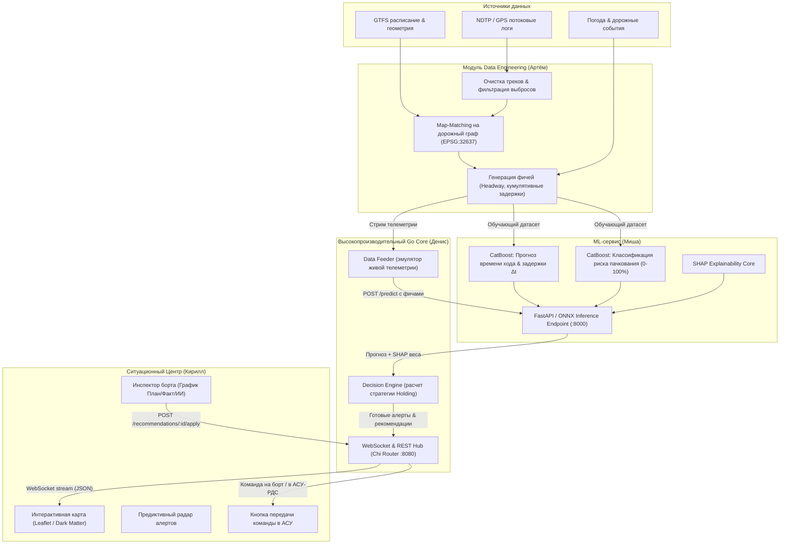
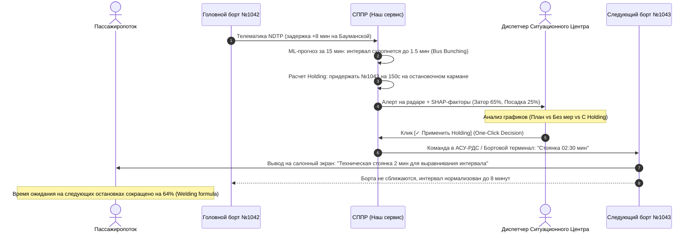
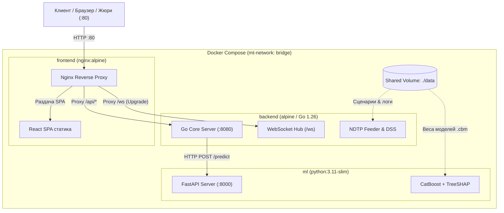

# 🏛 Системная, бизнесовая и инфраструктурная архитектура (Architecture Specification)

## 1. Системная архитектура и потоки данных

Система построена по модульному принципу с четким разделением ответственности между обработкой телеметрии высокой частоты (формат NDTP), аналитическим ML-инференсом и реактивным пользовательским интерфейсом.

---

## 2. Бизнес-архитектура процессов (Business Process Swimlane)

Бизнес-процесс ликвидации пачкования автобусов трансформирует диспетчерское управление из ручного реагирования в полуавтоматическую проактивную систему.

---

## 3. Ключевые компоненты системы

### 3.1. Go Backend Core (Денис)
* **Технологии:** Go 1.26+, Chi Router, Gorilla WebSocket.
* **Назначение:**
  * Обработка телеметрии с ультра-низким latency (< 5 мс, по тестам 34 микросекунды на запрос).
  * **Data Feeder:** воспроизводит исторические логи NDTP в псевдо-реальном времени с регулируемой скоростью (x1, x5) и возможностью мгновенного сброса.
  * **Decision Engine:** расчет корректирующих воздействий Holding с демпфированием и ограничением:
    $$d_i = \min\left(180, \ \frac{\alpha (H_{i, \text{ahead}} - H^*) + (1-\alpha)(H^* - H_{i, \text{behind}})}{2}\right)$$
  * Синхронизация состояний всех активных бортов и широковещательная рассылка дельт на фронтенд.

### 3.2. ML & XAI Engine (Миша)
* **Технологии:** Python 3.11+, CatBoost, LightGBM, SHAP, FastAPI, ONNX Runtime.
* **Назначение:**
  * Прогнозирование времени прохождения перегонов с учетом истории и внешних условий (Huber Loss).
  * Классификация вероятности пачкования ($P(\text{bunching}) \in [0, 1]$).
  * Извлечение локальных SHAP-значений для каждого сгенерированного алерта (топ-3 фактора влияния за <1 мс через C++ ядро CatBoost).

### 3.3. Data Engineering & Preprocessing (Артём)
* **Технологии:** Pandas, GeoPandas, Shapely, PyArrow.
* **Назначение:**
  * Проекция GPS/NDTP точек на полилинии маршрутов (векторный Map-Matching в метрической проекции EPSG:32637).
  * Расчет ключевой метрики интервала:
    $$Headway_i(t) = t_{arrival}(i) - t_{arrival}(i-1)$$
  * Фильтрация дребезга треков ($v > 90$ км/ч) и счисление пути (Dead Reckoning) при дропах пакетов сотовой связи.

### 3.4. Ситуационный дашборд (Кирилл)
* **Технологии:** React, Vite, Leaflet, CartoDB Dark Matter, Lucide Icons.
* **Назначение:**
  * Полноэкранный Slate Dark Mode (`#0B0F17`) интерфейс для оператора Ситуационного центра.
  * Визуализация динамических интервалов и пульсирующей связки пачкования между автобусами.
  * Парящие карточки предиктивного радара с обратным отсчетом времени до сбоя.
  * Интерактивный график динамики рейса:
    * Синяя пунктирная линия — нормативный график;
    * Красная пунктирная линия — прогноз модели без вмешательства (пачкование);
    * Зеленая сплошная линия — прогноз при подтверждении рекомендации ИИ.

---

## 4. Контейнеризация и инфраструктура (Docker Architecture)

Система полностью упакована в Docker и запускается **одной командой**:

### Спецификация Docker-образов:
1. **`backend/Dockerfile` (Multi-stage build):**
   * Сборщик: `golang:alpine` компилирует статический бинарник без CGO (`-ldflags="-s -w"`).
   * Раннер: `alpine:3.20` с сертификатами CA и таймзонами. Итоговый размер образа: **~18 МБ**!
2. **`frontend/Dockerfile` (Multi-stage build):**
   * Сборщик: `node:20-alpine` выполняет оптимизированную сборку `npm run build`.
   * Раннер: `nginx:alpine` раздает статику, сжимает gzip и прозрачно проксирует `/api/` и `/ws` в Go-сервис (полное исключение проблем с CORS).
3. **`ml/Dockerfile`:**
   * Базовый образ: `python:3.11-slim` с установленным менеджером пакетов `uv` и системной библиотекой `libgomp1` (поддержка многопоточности OpenMP для CatBoost).

---

## 5. Стратегия развертывания и масштабирования

| Сценарий | Окружение | Команда запуска | Для чего используется |
|---|---|---|---|
| **Локальная разработка** | Local OS (Go + Node + Python) | `make backend-run` `make frontend-dev` `make ml-run` | Максимальная скорость итераций, моментальный hot-reload, низкое потребление ресурсов. |
| **Проверка сдачи (Docker)** | Docker Compose (Все сервисы) | `docker compose up --build` | Воспроизводимость решения перед жюри за 1 команду. |
| **Публичный стенд для жюри** | Cloudflare Tunnel / VPS | `cloudflared tunnel --url http://localhost:80` | Доступ к живому демо-стенду по ссылке с мобильных телефонов и планшетов жюри на защите. |
